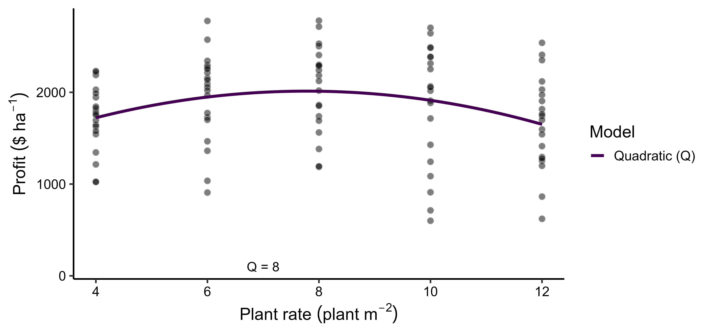
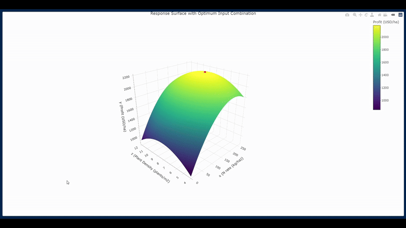

## Economic Optimization of Nitrogen Rate and Plant Density

This repository contains **code examples only** (no datasets) used for modeling the economic optimization of nitrogen (N) fertilizer rate and plant density in corn production. These analyses were developed for the **2025 NUE Hackathon**.

---

## Objectives

- **Economic Optimum Nitrogen Rate (EONR)**  
  Estimated using four agronomic response models:  
  - Linear-plateau  
  - Quadratic-plateau  
  - Quadratic  
  - Mitscherlich
  
  Model predictions are averaged using **Akaike Information Criterion (AIC) weights**, and **confidence intervals** for the EONR are obtained via **bootstrap aggregation (bagging)**.

  

- **Economic Optimum Plant Density (EOPD)**  
  Estimated using a quadratic model.  

  

- **Joint Optimization of N Rate × Plant Density**  
  Modeled using a Bayesian quadratic response surface to identify combinations that maximize profit.  

  **Surface Response Model (Video)**  
  

---

## Repository Structure

- `Economically_Optimal_Nitrogen_Rate.qmd` – Quarto file for EONR modeling using four models.  
- `Economically_Optimal_Plant_Density.qmd` – Quarto file for EOPD modeling using a quadratic model.  
- `Bayesian_Quadratic_Response_Surface.qmd` – Quarto file for fitting the Bayesian response surface to N × plant density.  
- `NUE Workshop Hackathon 2025.Rproj` – RStudio project file.

---
